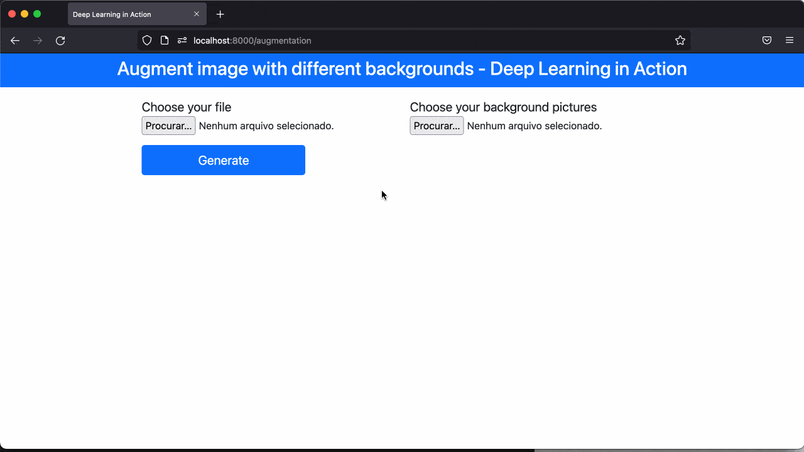

# Background Removal with Deep Learning

This repository show the code to remove the background of the pictures using the [U2Net](https://arxiv.org/pdf/2005.09007.pdf) pre-trained model.

The application has three simple functions:

1. Remove the background, producing a transparent PNG file.

2. Change the background by another picture.

3. Combine the image and multiple backgrounds to augment the dataset.


### Demos

<hr>




### Endpoint available
| Endpoint | Description
| --- | ---
| http://localhost:8000/ |  Front-end to perform background remove.
| http://localhost:8000/augmentation |  Front-end to perform augment images.


### Install
1. Clone this repository
```bash
git clone https://github.com/renatoviolin/bg-remove-augment.git
cd bg-remove-augment
```

2. Install dependencies
```bash
pip install -r requirements.txt
```


3. Download the pre-trained model
```bash
gdown --id 1ao1ovG1Qtx4b7EoskHXmi2E9rp5CHLcZ -O ./ckpt/u2net.pth
```


4. Start web-application
```bash
cd webapp
uvicorn app:app --host 0.0.0.0 --port 8000
```

### References
U2Net: [https://github.com/xuebinqin/U-2-Net](https://github.com/xuebinqin/U-2-Net)


### BibTeX
    @InProceedings{Qin_2020_PR,
        title = {U2-Net: Going Deeper with Nested U-Structure for Salient Object Detection},
        author = {Qin, Xuebin and Zhang, Zichen and Huang, Chenyang and Dehghan, Masood and Zaiane, Osmar and Jagersand, Martin},
        journal = {Pattern Recognition},
        volume = {106},
        pages = {107404},
        year = {2020}
}